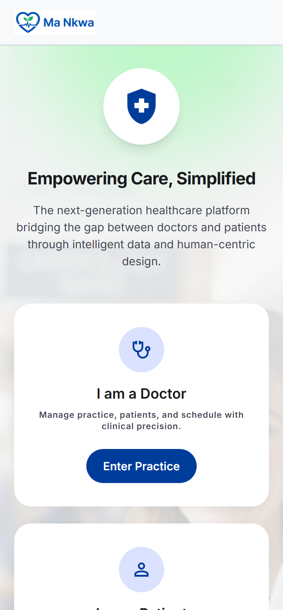
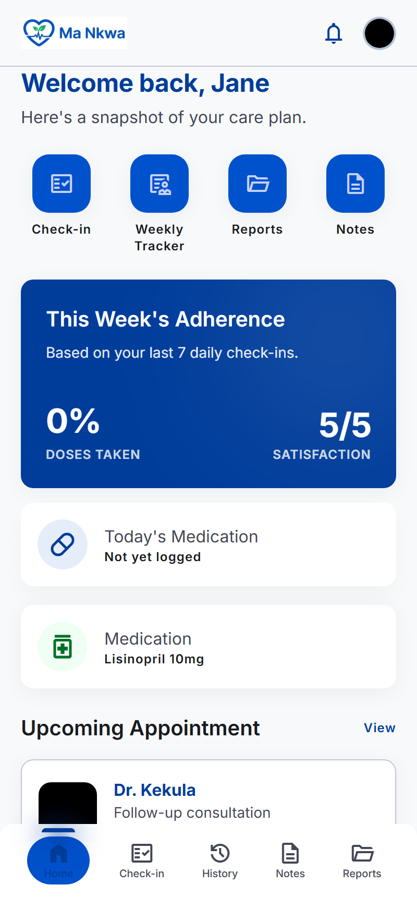
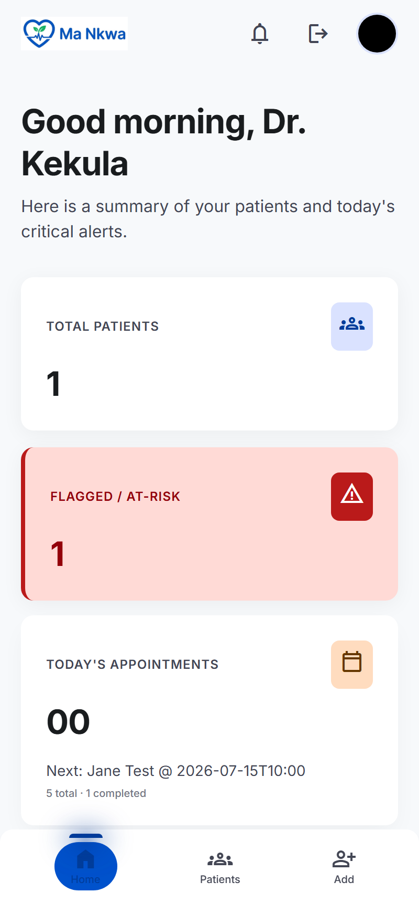
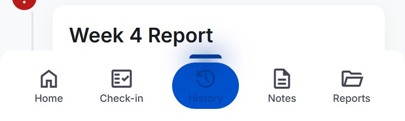

# Ma Nkwa

Medication tracking and doctor-patient remote monitoring platform. Patients log daily medication adherence and weekly symptom reports; doctors monitor patients through a dashboard with automatic risk flagging.

Repo: https://github.com/EmmanuelOwusuAdu7583/ma-nkwa
Live app: https://ma-nkwa.onrender.com

## Screenshots

<table>
<tr>
<td></td>
<td></td>
<td></td>
</tr>
<tr>
<td align="center">Welcome</td>
<td align="center">Patient dashboard</td>
<td align="center">Doctor dashboard</td>
</tr>
</table>



## Tech Stack

- Python 3 / Flask
- SQLite (`healio.db`)
- Server-rendered Jinja templates, Tailwind CSS (CDN), vanilla JS

## Running Locally

```
pip install -r requirements.txt
python app.py
```

The app runs at `http://127.0.0.1:5000`. On first run it creates `healio.db` and a `static/uploads/` folder automatically.

### Environment Variables

| Variable | Purpose |
|---|---|
| `SECRET_KEY` | Flask session signing key |
| `ADMIN_PASSWORD` | Password for the admin login (`/admin/login`) |
| `ADMIN_CONTACT_EMAIL` | Contact email shown on support/help pages |

Local-dev fallback values are used if these aren't set — never rely on the fallbacks in production.

## User Roles

- **Admin** — adds doctor accounts via `/admin/doctors`
- **Doctor** — pre-registered by admin, creates patients, views dashboard, adds notes, resolves flags
- **Patient** — given a Patient Code + Doctor Code by their doctor; daily check-in, weekly tracker, views doctor notes
